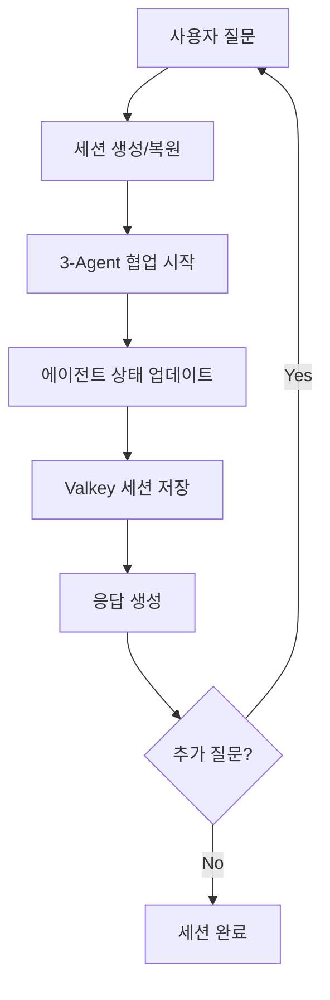

# CarFin AI - 종합 설계 계획서

## 🎯 설계 목표: "니 취향만 말해, 나머지는 내가 다 해줄게" 완벽 구현

### 핵심 설계 원칙
1. **즉시성**: 모든 응답 50ms 이하 목표
2. **연속성**: N번째 질문까지 끊김 없는 대화
3. **개인화**: 사용자별 맞춤 학습 및 기억
4. **확장성**: 10배 트래픽 증가 대응 가능

---

## 🏗️ Phase 1: 핵심 인프라 설계 (2주)

### 1. A2A 세션 관리 시스템 설계

#### 아키텍처 개요
```typescript
interface A2ASession {
  sessionId: string;
  userId: string;
  startTime: Date;
  lastActivity: Date;
  collaborationState: 'initiated' | 'analyzing' | 'completed';
  currentQuestion: string;
  discoveredNeeds: DiscoveredNeed[];
  agentStates: {
    concierge: AgentState;
    needsAnalyst: AgentState;
    dataAnalyst: AgentState;
  };
  vehicleRecommendations: VehicleRecommendation[];
  satisfactionLevel: number;
}
```

#### 상태 관리 플로우


#### 구현 우선순위
```yaml
Week 1:
  - 기본 세션 생성/저장/복원 로직
  - 3-Agent 상태 동기화 시스템
  - 세션 만료 및 정리 로직

Week 2:
  - 만족도 기반 세션 종료 판단
  - 세션 분석 및 인사이트 생성
  - A2A 성능 최적화
```

### 2. 실시간 대화 저장소 아키텍처 설계

#### 데이터 구조
```typescript
interface ConversationMessage {
  id: string;
  timestamp: Date;
  type: 'user' | 'agent' | 'system';
  agentName?: string;
  content: string;
  metadata: {
    sessionId: string;
    questionNumber: number;
    needsDiscovered?: string[];
    satisfactionIndicators?: string[];
  };
}

interface UserConversation {
  userId: string;
  sessions: ConversationSession[];
  totalMessages: number;
  firstInteraction: Date;
  lastInteraction: Date;
  preferenceProfile: UserPreferenceProfile;
}
```

#### 저장 전략
```yaml
실시간 저장:
  - 메시지별 즉시 Valkey 저장
  - 세션별 대화 히스토리 그룹화
  - 사용자별 대화 패턴 분석

장기 보관:
  - 24시간 후 PostgreSQL 아카이브
  - 개인화 데이터는 Valkey 영구 보관
  - 익명화 분석 데이터 별도 저장
```

#### UI/UX 설계
```yaml
대화 복원 UX:
  - 페이지 새로고침 시 즉시 대화 복원
  - "이전 대화 이어서 하기" 버튼
  - 대화 히스토리 타임라인 뷰

진행 상황 표시:
  - 실시간 타이핑 인디케이터
  - 3-Agent 협업 진행 상태
  - 만족도 기반 완료 제안
```

---

## 🧠 Phase 2: 지능형 개인화 시스템 (3주)

### 3. 사용자 선호도 학습 시스템 설계

#### 학습 데이터 모델
```typescript
interface UserPreferenceProfile {
  userId: string;
  demographics: {
    ageGroup: string;
    region: string;
    occupation: string;
  };
  vehiclePreferences: {
    brandPreference: string[];
    budgetRange: { min: number; max: number; };
    priorityFactors: string[];
    avoidanceFactors: string[];
  };
  interactionPatterns: {
    questioningStyle: 'detail-oriented' | 'quick-decision' | 'comparative';
    satisfactionTriggers: string[];
    typicalSessionLength: number;
  };
  learningHistory: {
    selectedVehicles: string[];
    rejectedReasons: string[];
    satisfactionScores: number[];
  };
}
```

#### 실시간 학습 알고리즘
```python
class PreferenceLearningEngine:
    def update_preferences(self, user_interaction):
        """사용자 상호작용 기반 선호도 업데이트"""

        # 1. 질문 패턴 분석
        question_analysis = self.analyze_question_pattern(
            user_interaction.questions
        )

        # 2. 만족도 신호 감지
        satisfaction_signals = self.detect_satisfaction_signals(
            user_interaction.responses
        )

        # 3. 선호도 가중치 조정
        updated_weights = self.adjust_preference_weights(
            current_preferences=user_interaction.user_profile,
            new_signals=satisfaction_signals
        )

        # 4. Valkey에 업데이트된 프로필 저장
        self.cache_updated_profile(user_interaction.user_id, updated_weights)

        return updated_weights
```

#### 개인화 추천 엔진
```yaml
실시간 개인화:
  - 사용자 프로필 기반 초기 추천
  - 대화 중 선호도 실시간 조정
  - 유사 사용자 패턴 매칭

학습 피드백 루프:
  - 선택한 차량 → 선호도 강화
  - 거부한 이유 → 회피 요소 학습
  - 만족도 표현 → 성공 패턴 학습
```

### 4. 성능 모니터링 대시보드 설계

#### 핵심 지표 대시보드
```yaml
실시간 성능 지표:
  - 응답 시간: 평균/P95/P99
  - 캐시 히트율: 시간대별/사용자별
  - 세션 연속성: 완료율/중단율
  - 만족도 점수: 실시간 집계

사용자 경험 지표:
  - N번째 질문 패턴: 질문 수 분포
  - 대화 완료율: 만족 종료 비율
  - 재방문율: 사용자 리텐션
  - 추천 정확도: 선택/거부 비율

시스템 건강도:
  - Valkey 성능: 메모리/네트워크
  - PostgreSQL 부하: 쿼리 성능
  - 3-Agent 협업: 응답 시간
  - 에러율: 타입별 에러 추적
```

#### 알림 및 자동 대응
```yaml
성능 임계값 알림:
  - 응답 시간 > 100ms: Slack 알림
  - 캐시 히트율 < 60%: 캐시 전략 검토
  - 에러율 > 1%: 즉시 대응 필요

자동 스케일링:
  - Valkey 메모리 > 80%: 인스턴스 확장 제안
  - 동시 사용자 > 1000명: 로드밸런서 추가
  - DB 커넥션 > 80%: 커넥션 풀 확장
```

---

## 🎨 Phase 3: UX/UI 고도화 (2주)

### 5. 대화형 UI 개선

#### 실시간 피드백 시스템
```typescript
interface ConversationFeedback {
  messageId: string;
  feedbackType: 'helpful' | 'confusing' | 'incomplete' | 'perfect';
  userComment?: string;
  contextualData: {
    questionNumber: number;
    agentInvolved: string[];
    timeToResponse: number;
  };
}

// 실시간 피드백 수집
const collectFeedback = async (messageId: string, feedback: ConversationFeedback) => {
  // 즉시 Valkey에 저장
  await redis.saveFeedback(messageId, feedback);

  // A2A 시스템에 피드백 반영
  await updateAgentPerformance(feedback.agentInvolved, feedback.feedbackType);

  // 실시간 개선 적용
  if (feedback.feedbackType === 'confusing') {
    await clarifyResponse(messageId);
  }
};
```

#### 진행 상황 시각화
```yaml
3-Agent 협업 시각화:
  - 각 에이전트별 작업 진행 상태
  - 실시간 분석 진행률 표시
  - 예상 완료 시간 안내

대화 플로우 가이드:
  - 현재 대화 단계 표시
  - 다음 질문 제안 미리보기
  - 만족도 기반 완료 가능 시점 안내
```

### 6. 모바일 최적화

#### 터치 기반 인터랙션
```yaml
모바일 UX 특화:
  - 빠른 응답 버튼 (예/아니오/더 알고 싶어요)
  - 음성 입력 지원
  - 스와이프 기반 차량 비교
  - 원터치 즐겨찾기

성능 최적화:
  - 이미지 지연 로딩
  - 대화 히스토리 가상 스크롤
  - 오프라인 모드 지원 (캐시된 데이터)
```

---

## 🔧 Phase 4: 고급 기능 및 통합 (3주)

### 7. AI 에이전트 성능 최적화

#### 동적 에이전트 로드밸런싱
```typescript
class AgentLoadBalancer {
  private agentPerformance: Map<string, AgentMetrics> = new Map();

  async selectOptimalAgent(taskType: string, complexity: number): Promise<string> {
    const availableAgents = this.getAvailableAgents(taskType);
    const performanceScores = await this.calculatePerformanceScores(availableAgents);

    // 복잡도와 성능을 고려한 최적 에이전트 선택
    return this.selectBestPerformingAgent(performanceScores, complexity);
  }

  async updateAgentMetrics(agentId: string, responseTime: number, satisfaction: number) {
    const metrics = this.agentPerformance.get(agentId) || new AgentMetrics();
    metrics.update(responseTime, satisfaction);

    // Valkey에 메트릭 저장
    await redis.saveAgentMetrics(agentId, metrics);
  }
}
```

#### 컨텍스트 인식 대화 관리
```yaml
대화 컨텍스트 추적:
  - 이전 질문들의 의도 연결
  - 모순되는 요구사항 감지
  - 잠재적 니즈 예측

스마트 질문 제안:
  - 사용자 패턴 기반 다음 질문 예측
  - 정보 부족 영역 자동 감지
  - 만족도 향상을 위한 질문 우선순위
```

### 8. 외부 시스템 통합

#### 실시간 매물 데이터 동기화
```typescript
class RealTimeVehicleSync {
  async syncVehicleData(): Promise<void> {
    // 외부 API에서 최신 매물 정보 수집
    const latestVehicles = await this.fetchLatestVehicles();

    // 변경된 매물 감지
    const changedVehicles = await this.detectChanges(latestVehicles);

    // PostgreSQL 업데이트
    await this.updateDatabase(changedVehicles);

    // 관련 캐시 무효화
    await this.invalidateRelatedCaches(changedVehicles);

    // 활성 세션에 업데이트 알림
    await this.notifyActiveSessions(changedVehicles);
  }
}
```

#### 금융상품 API 연동
```yaml
실시간 금융정보:
  - 대출 금리 실시간 업데이트
  - 리스 조건 동적 계산
  - 보험료 견적 즉시 제공

개인화 금융 추천:
  - 신용점수 기반 맞춤 상품
  - 소득 수준별 최적 구조
  - 세제 혜택 자동 계산
```

---

## 📊 성공 지표 및 검증 계획

### 핵심 성과 지표 (KPI)
```yaml
기술적 성능:
  - 평균 응답 시간: < 50ms (목표)
  - 캐시 히트율: > 70% (목표)
  - 시스템 가용성: > 99.9% (목표)
  - 세션 연속성: > 95% (목표)

사용자 만족도:
  - N번째 질문 완료율: > 80% (목표)
  - 추천 차량 선택률: > 60% (목표)
  - 사용자 재방문율: > 40% (목표)
  - 만족도 점수: > 4.5/5.0 (목표)

비즈니스 임팩트:
  - 상담 완료 시간: 50% 단축 (목표)
  - 고객 전환율: 2배 향상 (목표)
  - 운영 비용: 30% 절감 (목표)
```

### A/B 테스트 계획
```yaml
Week 4-6: 기본 기능 A/B 테스트
  - Valkey 캐싱 ON/OFF 비교
  - 응답 시간이 사용자 만족도에 미치는 영향
  - 세션 복원 기능의 재방문율 영향

Week 8-10: 고급 기능 A/B 테스트
  - 개인화 추천 vs 일반 추천
  - 3-Agent vs 2-Agent 협업 효과
  - 실시간 피드백 시스템 효과

Week 12-14: 통합 시스템 검증
  - 전체 플로우 사용자 테스트
  - 스트레스 테스트 (1000명 동시 접속)
  - 장기 사용 패턴 분석
```

---

## 🛡️ 리스크 관리 및 백업 계획

### 기술적 리스크 대응
```yaml
Valkey 장애 대응:
  - PostgreSQL 직접 조회 자동 폴백
  - 세션 데이터 임시 로컬 저장
  - 복구 후 자동 동기화

성능 저하 대응:
  - 실시간 성능 모니터링
  - 자동 스케일링 트리거
  - 부하 분산 알고리즘 적용

데이터 무결성:
  - 실시간 백업 및 복제
  - 데이터 검증 자동화
  - 롤백 시나리오 준비
```

### 사용자 경험 리스크
```yaml
서비스 중단 최소화:
  - 무중단 배포 전략
  - 단계적 롤아웃
  - 실시간 헬스체크

사용자 데이터 보호:
  - 개인정보 암호화
  - 익명화 처리
  - GDPR 컴플라이언스
```

---

## 🎯 구현 타임라인

### Phase 1: 핵심 인프라 (Week 1-2)
- ✅ Valkey 캐싱 시스템 (완료)
- 🔄 A2A 세션 관리 구현
- 🔄 실시간 대화 저장소 구현

### Phase 2: 지능형 개인화 (Week 3-5)
- 사용자 선호도 학습 시스템
- 성능 모니터링 대시보드
- 개인화 추천 엔진

### Phase 3: UX/UI 고도화 (Week 6-7)
- 대화형 UI 개선
- 모바일 최적화
- 실시간 피드백 시스템

### Phase 4: 고급 기능 (Week 8-10)
- AI 에이전트 최적화
- 외부 시스템 통합
- 종합 테스트 및 검증

---

*이 설계 계획서는 CarFin AI의 "니 취향만 말해, 나머지는 내가 다 해줄게" 약속을 완벽히 실현하기 위한 기술적 로드맵입니다. 각 단계는 사용자 경험 향상과 시스템 확장성을 동시에 보장하도록 설계되었습니다.*