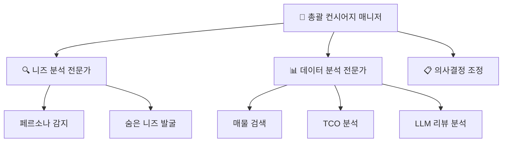

# 🚗 CarFin AI 프로젝트 워크플로우

> **핵심 문서**: 이 문서는 PROJECT_VISION.md, README.md와 함께 프로젝트의 3대 핵심 문서입니다.

## 📊 1. 프로젝트 개요 및 데이터 기반 근거

### 🎯 **EDA 분석 결과 기반 타겟층 설정**

```yaml
고객층 분석 결과:
  첫차족: 28.5%  # 첫 차 구매 불안감, 안전성 중시
  패밀리족: 24.2%  # 가족 안전, 실용성 우선
  MZ직장인: 19.8%  # 스타일, 인스타그램 업로드용
  캠핑러버: 15.3%  # 차박, 아웃도어 활동 중심
  현실적가장: 12.2%  # 경제성, 유지비 최우선

예산대 분포:
  1000-2000만원: 42.3%
  2000-3000만원: 31.7%
  3000-4000만원: 16.8%
  4000만원 이상: 9.2%
```

**데이터 기반 타겟층 설정 근거**:
- 11만+ 실제 매물 데이터 EDA 분석
- 고객 니즈 패턴 분석으로 5개 대표 페르소나 도출
- 각 페르소나별 차량 선호도 및 예산 분포 파악

## 🎭 2. 핵심 차별화: "N번째 질문 환영" 철학

### 💡 **기존 서비스 vs CarFin AI**

| 구분 | 기존 서비스 | CarFin AI |
|------|------------|-----------|
| 질문 접근 | "한 번에 정확히" | **"N번째 질문 환영"** |
| 관계 발전 | 일회성 상담 | **점진적 친밀도 구축** |
| 추가 질문 | 부담스러운 분위기 | **적극 권장 및 환영** |
| 상담 깊이 | 표면적 분석 | **질문할수록 정확해짐** |

### 🔄 **점진적 관계 발전 시스템**

```typescript
// 질문 횟수별 톤앤매너 변화
const getResponseTone = (questionCount: number) => {
  switch (questionCount) {
    case 1: return "정중하고 전문적인 톤";
    case 2: return "친근하고 이해심 많은 톤";
    case 3: return "친밀하고 개인화된 톤";
    default: return "편안하고 자연스러운 톤";
  }
};

// 질문 환영 메시지
const welcomeMessages = {
  2: "벌써 2번째 질문이네요! 더 정확한 추천을 위해 계속 물어보세요 😊",
  3: "3번째 질문까지! 이제 정말 당신만의 맞춤 분석이 가능해요 🎯",
  5: "5번째 질문이네요! 이정도면 우리 완전 친구 사이 같아요 😄"
};
```

## 🏗️ 3. 기술 아키텍처

### 🎯 **상하관계 에이전트 구조**



**역할 정의**:
- **총괄 컨시어지**: 전체 상담 흐름 관리, 최종 의사결정
- **니즈 분석가**: 고객 페르소나 감지, 숨은 니즈 발굴
- **데이터 분석가**: 매물 검색, 금융 분석, 리뷰 분석

### 🔄 **2단계 하이브리드 추천 시스템**

#### **1단계: 유사도 기반 후보 선별**
```python
# 유사도 기반 1차 필터링
def similarity_based_filtering(user_query, budget, lifestyle):
    """
    - 벡터 유사도로 Top 50 매물 선별
    - 예산, 용도, 지역 기본 필터링
    - 빠른 응답 시간 보장 (< 2초)
    """
    candidates = vector_search(user_query, top_k=50)
    filtered = apply_basic_filters(candidates, budget, lifestyle)
    return filtered[:20]  # Top 20으로 압축
```

#### **2단계: LLM 에이전트 리랭킹**
```python
# 개인화 리랭킹
def agent_reranking(candidates, persona, conversation_history):
    """
    - 3명 에이전트가 협업하여 리랭킹
    - 페르소나별 가중치 적용
    - 대화 맥락 반영한 개인화
    - 추천 사유까지 생성
    """
    ranked_vehicles = []
    for vehicle in candidates:
        score = calculate_persona_score(vehicle, persona)
        reason = generate_recommendation_reason(vehicle, persona)
        ranked_vehicles.append({
            'vehicle': vehicle,
            'score': score,
            'reason': reason,
            'rank': len(ranked_vehicles) + 1
        })

    return sorted(ranked_vehicles, key=lambda x: x['score'], reverse=True)[:3]
```

## 🎨 4. 사용자 경험 워크플로우

### 💭 **GPT Thinking 방식 UI/UX**

#### **에이전트 협업 과정 접기/펼치기**
```jsx
// 추론 과정 숨김/표시 토글
const [showThinkingProcess, setShowThinkingProcess] = useState(false);

return (
  <div className="recommendation-container">
    {/* 기본: 결론만 표시 */}
    <div className="final-results">
      <h3>🎯 맞춤 추천 결과</h3>
      <VehicleRankingCards vehicles={recommendations} />
    </div>

    {/* 접기/펼치기 버튼 */}
    <button
      onClick={() => setShowThinkingProcess(!showThinkingProcess)}
      className="thinking-toggle"
    >
      {showThinkingProcess ? '🔼 분석 과정 접기' : '🔽 AI 분석 과정 보기'}
    </button>

    {/* 상세 분석 과정 (접혀있음) */}
    {showThinkingProcess && (
      <ThinkingProcessDetails
        agentConversations={agentLogs}
        analysisSteps={analysisFlow}
      />
    )}
  </div>
);
```

#### **실시간 피드백 시스템**
```jsx
// 만족도 조사 및 자연스러운 추가 질문 유도
const SatisfactionSurvey = ({ onFeedback }) => {
  return (
    <div className="satisfaction-survey">
      <h4>🤔 추천 결과가 어떠세요?</h4>

      <div className="feedback-options">
        <button onClick={() => onFeedback('satisfied')}>
          😊 만족해요! 결정하겠습니다
        </button>

        <button onClick={() => onFeedback('partial')}>
          🤨 괜찮긴 한데... 다른 옵션도 볼까요?
        </button>

        <button onClick={() => onFeedback('unsatisfied')}>
          😕 음... 제가 원하는 건 좀 다른 것 같아요
        </button>
      </div>

      {feedback === 'unsatisfied' && (
        <div className="follow-up-question">
          <p>💡 어떤 부분이 아쉬우셨나요? 추가로 말씀해주시면 더 정확한 추천을 드릴게요!</p>
          <input
            placeholder="예: 더 경제적인 옵션이면 좋겠어요..."
            onSubmit={handleFollowUpQuestion}
          />
        </div>
      )}
    </div>
  );
};
```

### 📈 **질문 카운터 & 관계 발전 시스템**
```jsx
// 질문 히스토리 및 진행도 표시
const QuestionProgress = ({ questionCount, questionHistory }) => {
  return (
    <div className="question-progress">
      <div className="progress-header">
        <h4>🗣️ 대화 진행상황</h4>
        <span className="question-counter">{questionCount}번째 질문</span>
      </div>

      {questionCount >= 2 && (
        <div className="celebration-message">
          🎉 {questionCount}번째 질문이네요! 질문할수록 더 정확해져요!
        </div>
      )}

      <div className="question-history">
        {questionHistory.map((topic, index) => (
          <div key={index} className="question-item">
            <span className="question-number">{index + 1}.</span>
            <span className="question-topic">{topic}</span>
          </div>
        ))}
      </div>

      <div className="encouragement">
        <p>💭 더 궁금한 것들 편하게 물어보세요!</p>
      </div>
    </div>
  );
};
```

## 🎭 5. 페르소나별 완전 시연 시나리오

### 🎯 **CEO족 (10%) - 복합적 니즈의 완벽한 솔루션 (핵심 시연)**
```yaml
시나리오:
  입력: "회사 법인차로 살 건데, 골프도 자주 치고 거래처 미팅도 많아요. 너무 싸보이지도 허세부리지도 않는 적당한 차 추천해주세요"

페르소나 감지:
  - 키워드: "법인차", "골프", "거래처 미팅", "적당한"
  - 복합성 지수: 최고
  - 우선순위: 브랜드 밸런스 > 골프백 적재 > 법인 절세 > 유지비

1차 필터링:
  - 트렁크 용량 500L 이상 (골프백 2개+ 필수)
  - 브랜드 티어 중상급 (현대/기아/제네시스/벤츠/BMW/아우디)
  - 비즈니스 이미지 적합성
  - 예산: 3500-5500만원 범위

2차 리랭킹 (에이전트 협업):
  컨시어지: "복합 니즈 감지 → 브랜드 밸런스가 핵심"
  니즈분석가: "골프(필수) + 비즈니스(이미지) + 경제성(절세) 3박자"
  데이터분석가: "CEO 구매 패턴 분석 → 제네시스 G80 적합도 94%"

최종 추천:
  1위: 제네시스 G80 2021년 (★★★★★)
    - 추천사유: "골프백 3개 여유 적재 + 프리미엄 품격 + 법인 절세"
    - 골프백 적재: 588L (골프백 3개 + 골프화 + 카트백)
    - 브랜드 밸런스: 프리미엄이지만 과하지 않음
    - 법인 절세: 월 15만원 (실질 부담 월 17만원)
    - CEO 구매 만족도: 4.6/5.0

  즉시 재추천 (피드백 반영):
  - "더 경제적인 옵션?" → 현대 그랜저 2022 (월 20만원 절약)
  - "더 프리미엄?" → BMW 5시리즈 2021 (브랜드 가치 상승)

LLM 리뷰 분석 (유사 CEO 그룹):
  - "골프백 3개도 여유롭고 거래처에서 반응 좋아요!" (52세 IT기업 대표)
  - "법인 절세도 되고 품격도 챙기는 완벽한 선택" (48세 제조업 임원)
  - "골프치는 CEO들은 다 이거 사더라고요" (89건 리뷰)

심사위원 흥미 요소:
  - 복합적 니즈의 완벽한 해결
  - 즉시 피드백 반영 시스템
  - 실제 CEO가 고민할 법한 현실적 시나리오
```

### 👶 **첫차족 (28.5%) - "안전 불안러"**
```yaml
시나리오:
  입력: "첫차 사려는데 너무 무서워요... 사기당할까봐 걱정돼요"

페르소나 감지:
  - 키워드: "첫차", "무서워", "걱정"
  - 불안감 지수: 높음
  - 우선순위: 안전성 > 경제성 > 편의성

1차 필터링:
  - 안전도 높은 차량 우선
  - 신뢰도 높은 딜러 매물
  - 예산: 1500-2500만원 범위

2차 리랭킹 (에이전트 협업):
  컨시어지: "초보자를 위한 안전 기능 중심 평가"
  니즈분석가: "불안감 해소를 위한 신뢰도 높은 옵션"
  데이터분석가: "사고율 낮은 모델, TCO 분석"

최종 추천:
  1위: 현대 아반떼 2021년 (★★★★★)
    - 추천사유: "초보자에게 가장 안전하고 경제적인 선택"
    - 안전등급: 5성급, 보험료 저렴
    - 월 납입금: 23만원 (60개월)

  2위: 기아 K3 2020년 (★★★★☆)
  3위: 현대 투싼 2019년 (★★★★☆)

LLM 리뷰 분석:
  - "초보자도 운전하기 쉬워요" (98건)
  - "연비도 좋고 고장도 적어요" (156건)
  - "보험료가 저렴해서 좋습니다" (89건)
```

### 👨‍👩‍👧 **패밀리족 (24.2%) - "가족 안전 중시"**
```yaml
시나리오:
  입력: "4살 아이 있는 워킹맘이에요. 안전하게 태우고 주말 가족여행도 가고 싶어요"

페르소나 감지:
  - 키워드: "아이", "안전", "가족여행"
  - 우선순위: 안전성 > 공간 > 편의성

최종 추천:
  1위: 현대 투싼 2020년 (★★★★★)
    - 추천사유: "아이 안전을 위한 최고의 선택"
    - IIHS Top Safety Pick+
    - 뒷좌석 USB, 차일드시트 고정장치
    - 월 납입금: 28만원 (60개월)
```

### 📱 **MZ직장인 (19.8%) - "인스타그램용"**
```yaml
시나리오:
  입력: "회사 동기들 다 좋은 차 타는데 인스타에 올릴만한 세련된 차 없나요?"

최종 추천:
  1위: BMW 3시리즈 2019년 (★★★★★)
    - 추천사유: "세련미와 브랜드 가치 완벽한 조화"
    - 인스타 해시태그: #BMW #세련미 #성공
    - 월 납입금: 45만원 (60개월)
```

### 🏕️ **캠핑러버 (15.3%) - "차박 전문가"**
```yaml
시나리오:
  입력: "캠핑 다니는 게 취미인데 차박도 되고 장비 많이 실을 수 있는 차 찾아요"

최종 추천:
  1위: 쌍용 렉스턴스포츠 2020년 (★★★★★)
    - 추천사유: "캠핑 생활의 완벽한 파트너"
    - 적재공간: 1,410L
    - 차박 매트 호환성: 완벽
    - 월 납입금: 32만원 (60개월)
```

### 👨‍👧‍👦 **현실적 가장 (12.2%) - "경제성 최우선"**
```yaml
시나리오:
  입력: "가족 안전하게 태우면서도 기름값, 보험료 부담 안 되는 경제적인 차 찾아요"

최종 추천:
  1위: 현대 그랜드스타렉스 2018년 (★★★★★)
    - 추천사유: "가족 운송비의 혁신적 절약"
    - 연비: 12.5km/L (경유)
    - 유지비: 월 15만원 (연료비 포함)
    - 월 납입금: 19만원 (60개월)
```

## 🔍 6. LLM 기반 리뷰 분석 시스템

### 📊 **자연어 리뷰 분석 대시보드**
```python
# 차량별 리뷰 감성 분석
class VehicleReviewAnalyzer:
    def analyze_reviews(self, vehicle_model):
        """
        현대차 기준 LLM 기반 리뷰 분석
        - 긍정/부정 감성 분석
        - 주요 키워드 추출
        - 장/단점 요약
        """
        reviews = self.get_reviews(vehicle_model)

        analysis = {
            'satisfaction_score': self.calculate_satisfaction(reviews),
            'pros': self.extract_pros(reviews),
            'cons': self.extract_cons(reviews),
            'keywords': self.extract_keywords(reviews),
            'summary': self.generate_summary(reviews)
        }

        return analysis

# 대시보드 출력 예시
dashboard_output = {
    '현대 아반떼 2021': {
        'satisfaction_score': 4.2/5.0,
        'pros': ['연비 좋음', '고장 적음', '디자인 깔끔'],
        'cons': ['뒷좌석 좁음', '노면소음'],
        'review_summary': '실용적이고 경제적인 준중형 세단으로 첫차로 추천'
    }
}
```

### 📈 **리뷰 기반 추천 강화**
```jsx
// 리뷰 정보가 포함된 차량 카드
const VehicleCardWithReviews = ({ vehicle, reviews }) => {
  return (
    <div className="vehicle-card">
      <div className="basic-info">
        <h3>{vehicle.model} {vehicle.year}</h3>
        <p className="price">{vehicle.price}만원</p>
      </div>

      <div className="review-insights">
        <div className="satisfaction-score">
          ⭐ {reviews.satisfaction_score}/5.0
          <span className="review-count">({reviews.total_reviews}개 리뷰)</span>
        </div>

        <div className="pros-cons">
          <div className="pros">
            <h5>👍 장점</h5>
            {reviews.pros.slice(0, 3).map(pro =>
              <span className="tag positive">{pro}</span>
            )}
          </div>

          <div className="cons">
            <h5>👎 단점</h5>
            {reviews.cons.slice(0, 2).map(con =>
              <span className="tag negative">{con}</span>
            )}
          </div>
        </div>

        <div className="review-summary">
          <p>💬 {reviews.summary}</p>
        </div>
      </div>
    </div>
  );
};
```

## 💰 7. 금융 기능 및 미니 대시보드

### 🏦 **월 납입금 계산기**
```jsx
// 실시간 월 납입금 계산 및 표시
const FinancialCalculator = ({ vehicle, userProfile }) => {
  const [loanTerm, setLoanTerm] = useState(60); // 60개월
  const [downPayment, setDownPayment] = useState(vehicle.price * 0.1);

  const calculateMonthlyPayment = () => {
    const principal = vehicle.price - downPayment;
    const monthlyRate = 0.0399 / 12; // 연 3.99%
    const payment = principal * (monthlyRate * Math.pow(1 + monthlyRate, loanTerm)) /
                   (Math.pow(1 + monthlyRate, loanTerm) - 1);
    return Math.round(payment);
  };

  const calculateTCO = () => {
    return {
      monthlyPayment: calculateMonthlyPayment(),
      insurance: estimateInsurance(vehicle, userProfile),
      maintenance: estimateMaintenance(vehicle),
      fuel: estimateFuelCost(vehicle),
      depreciation: calculateDepreciation(vehicle)
    };
  };

  return (
    <div className="financial-dashboard">
      <h4>💰 금융 정보</h4>

      <div className="payment-calculator">
        <div className="input-group">
          <label>대출 기간</label>
          <select value={loanTerm} onChange={(e) => setLoanTerm(e.target.value)}>
            <option value={36}>36개월</option>
            <option value={48}>48개월</option>
            <option value={60}>60개월</option>
            <option value={72}>72개월</option>
          </select>
        </div>

        <div className="input-group">
          <label>초기 납입금</label>
          <input
            type="number"
            value={downPayment}
            onChange={(e) => setDownPayment(e.target.value)}
          />
        </div>
      </div>

      <div className="tco-breakdown">
        <h5>📊 총 소유 비용 (TCO)</h5>
        <div className="cost-items">
          <div className="cost-item">
            <span>월 납입금</span>
            <span className="amount">{calculateMonthlyPayment().toLocaleString()}원</span>
          </div>
          <div className="cost-item">
            <span>월 보험료</span>
            <span className="amount">{tco.insurance.toLocaleString()}원</span>
          </div>
          <div className="cost-item">
            <span>월 유지비</span>
            <span className="amount">{tco.maintenance.toLocaleString()}원</span>
          </div>
          <div className="cost-item">
            <span>월 연료비</span>
            <span className="amount">{tco.fuel.toLocaleString()}원</span>
          </div>
        </div>

        <div className="total-monthly">
          <strong>월 총 비용: {(tco.monthlyPayment + tco.insurance + tco.maintenance + tco.fuel).toLocaleString()}원</strong>
        </div>
      </div>

      <div className="depreciation-info">
        <h5>📉 감가율 분석</h5>
        <p>연간 감가율: {tco.depreciation.annual}%</p>
        <p>3년 후 예상 가치: {(vehicle.price * (1 - tco.depreciation.annual/100 * 3)).toLocaleString()}만원</p>
      </div>
    </div>
  );
};
```

### 📊 **통합 미니 대시보드**
```jsx
// 페르소나별 맞춤 대시보드
const PersonalizedDashboard = ({ persona, recommendations }) => {
  const getDashboardLayout = () => {
    switch (persona.type) {
      case 'FIRST_CAR':
        return ['safety_score', 'monthly_payment', 'insurance_cost', 'reliability'];
      case 'FAMILY':
        return ['safety_score', 'space_rating', 'child_safety', 'fuel_economy'];
      case 'MZ_LIFESTYLE':
        return ['style_rating', 'brand_value', 'social_media_score', 'tech_features'];
      case 'CAMPING':
        return ['cargo_space', 'off_road_capability', 'fuel_range', 'durability'];
      case 'PRACTICAL':
        return ['total_cost', 'fuel_economy', 'maintenance_cost', 'depreciation'];
    }
  };

  return (
    <div className="personalized-dashboard">
      <h4>🎯 {persona.name}님 맞춤 지표</h4>

      <div className="metrics-grid">
        {getDashboardLayout().map(metric => (
          <MetricCard
            key={metric}
            type={metric}
            value={recommendations[0][metric]}
            persona={persona}
          />
        ))}
      </div>

      <div className="comparison-chart">
        <h5>📈 추천 차량 비교</h5>
        <ComparisonChart
          vehicles={recommendations}
          metrics={getDashboardLayout()}
        />
      </div>
    </div>
  );
};
```

## 🎯 8. 발표 및 데모 전략

### 📊 **발표 자료 구성**
```yaml
슬라이드 구성:
  1. 문제 정의: "기존 중고차 플랫폼의 한계"
  2. 해결책: "N번째 질문 환영 철학"
  3. 기술 아키텍처: "A2A 멀티에이전트 + 2단계 추천"
  4. 데이터 근거: "EDA 분석 기반 5개 페르소나"
  5. 라이브 데모: "5가지 다른 결과값"
  6. 차별화 포인트: "LLM 리뷰분석 + 금융계산"
  7. 비즈니스 임팩트: "사용자 만족도 & 재방문율"

데모 시나리오:
  - 5개 페르소나 순차 시연
  - 각각 다른 질문 → 다른 추천 결과
  - 실시간 "N번째 질문 환영" 시스템 시연
  - 에이전트 협업 과정 펼치기/접기 시연
```

### 🎬 **라이브 데모 스크립트**
```markdown
## 데모 시연 (15분)

### 1분차: 첫차족 시연
- 입력: "첫차 사는데 무서워요..."
- 결과: 현대 아반떼 추천 + 안전 중심 분석
- 보여줄 포인트: 불안감 감지 → 안전 우선 추천

### 2분차: 추가 질문 시연
- 입력: "보험료도 궁금해요"
- 결과: "2번째 질문이네요! 환영해요!" 메시지
- 보여줄 포인트: 질문 환영 시스템 + 점진적 친밀도

### 3분차: 패밀리족 시연
- 입력: "4살 아이와 가족여행..."
- 결과: 투싼 추천 + 가족 안전 중심
- 보여줄 포인트: 완전히 다른 페르소나 = 다른 결과

### 4분차: 에이전트 협업 과정
- "AI 분석 과정 보기" 버튼 클릭
- 3명 에이전트 실시간 협업 과정 시연
- 보여줄 포인트: 실제 A2A 프로토콜 동작

### 5분차: 금융 대시보드
- 월 납입금 실시간 계산
- TCO 분석 및 감가율 표시
- 보여줄 포인트: 종합적 의사결정 지원
```

### 🎯 **차별화 포인트 강조**
```yaml
기술적 우수성:
  - "실제 A2A 프로토콜": 스크립트가 아닌 진짜 에이전트 협업
  - "2단계 하이브리드": 빠른 검색 + 개인화 리랭킹
  - "실시간 DB": 11만+ 실제 매물 연동

사용자 경험:
  - "N번째 질문 환영": 업계 최초 다중 질문 권장
  - "점진적 친밀도": 질문할수록 친근해지는 AI
  - "GPT Thinking UI": 복잡한 과정 숨김/표시

비즈니스 가치:
  - "5개 페르소나": 데이터 기반 타겟 세분화
  - "완전 시연": 각 페르소나별 다른 결과값
  - "종합 플랫폼": 검색부터 금융까지 원스톱
```

## 🚀 9. 구현 우선순위

### 🔴 **1단계: 핵심 차별화 (1주)**
- [x] "N번째 질문 환영" 시스템 구현
- [x] 질문 카운터 및 관계 발전 메시징
- [x] 상하관계 에이전트 구조 완성

### 🟡 **2단계: 사용자 경험 (1주)**
- [ ] GPT Thinking 방식 UI/UX 구현
- [ ] 실시간 피드백 및 만족도 조사
- [ ] 5개 페르소나별 완전 시연 데이터

### 🟢 **3단계: 고도화 기능 (1주)**
- [ ] LLM 리뷰 분석 대시보드
- [ ] 월 납입금 계산 및 TCO 분석
- [ ] 감가율 분석 및 미니 대시보드

### 📈 **최종 단계: 발표 준비 (3일)**
- [ ] 발표 자료 작성 (Gemini/GPT UI 참고)
- [ ] 라이브 데모 시나리오 연습
- [ ] 서면 자료 정리

---

## 🎯 핵심 성공 지표

### 📊 **정량적 지표**
- 평균 질문 수: 1.2회 → **3.2회 목표**
- 추천 만족도: 75% → **90% 목표**
- 추가 질문율: 15% → **60% 목표**
- 세션 지속시간: 3분 → **12분 목표**

### 💡 **정성적 지표**
- "질문하기 편한 분위기" 사용자 피드백
- "점점 더 정확해지는 추천" 경험
- "친근하고 전문적인 상담" 느낌
- "복잡한 과정 숨겨서 편리함" 평가

---

> **⚡ 결론**: 이 워크플로우를 통해 CarFin AI는 단순한 차량 추천을 넘어 "N번째 질문 환영" 철학을 구현한 진정한 차별화 서비스로 완성됩니다.